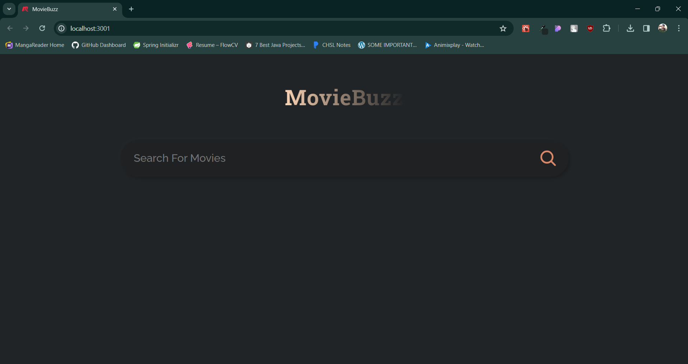
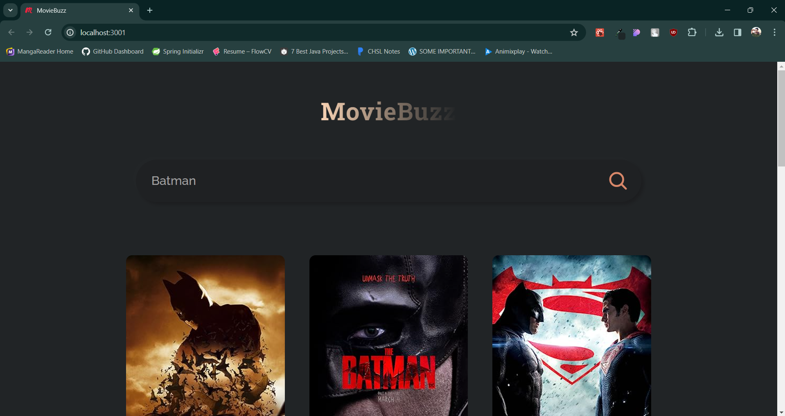
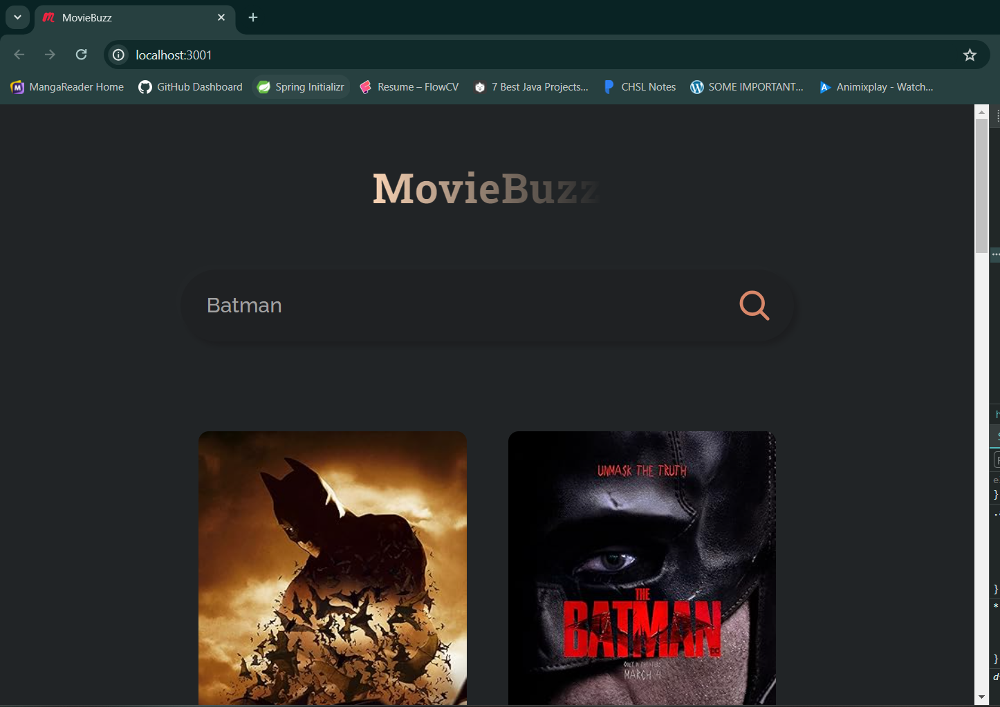
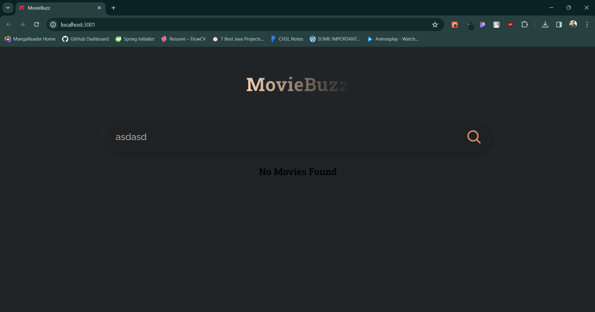

# Movie Web App

This is a Movie Web App built with React and CSS.

## Overview

This application allows users to search for movies using the OMDB API and view details about each movie.

## Features

- Search for movies by title
- View detailed information about each movie, including title, release year, plot, and poster image

## Installation

1. Clone the repository: (`git clone https://github.com/Siddharth263/react-movie-app.git`)
2. Navigate to the project directory: (`cd react-movie-app`)
3. install dependencies: (`npm install`)
4. Start the development server: (`npm start`)
5. Open http://localhost:3000 in your web browser to view the app.

## Usage

- Enter a movie title in the search bar and press Enter or click the search button to search for movies.
- Click on a movie to view its details.

## Technologies Used

- ReactJs
- CSS

## Screenshots

## Credits

- The OMDB API for providing movie data.
